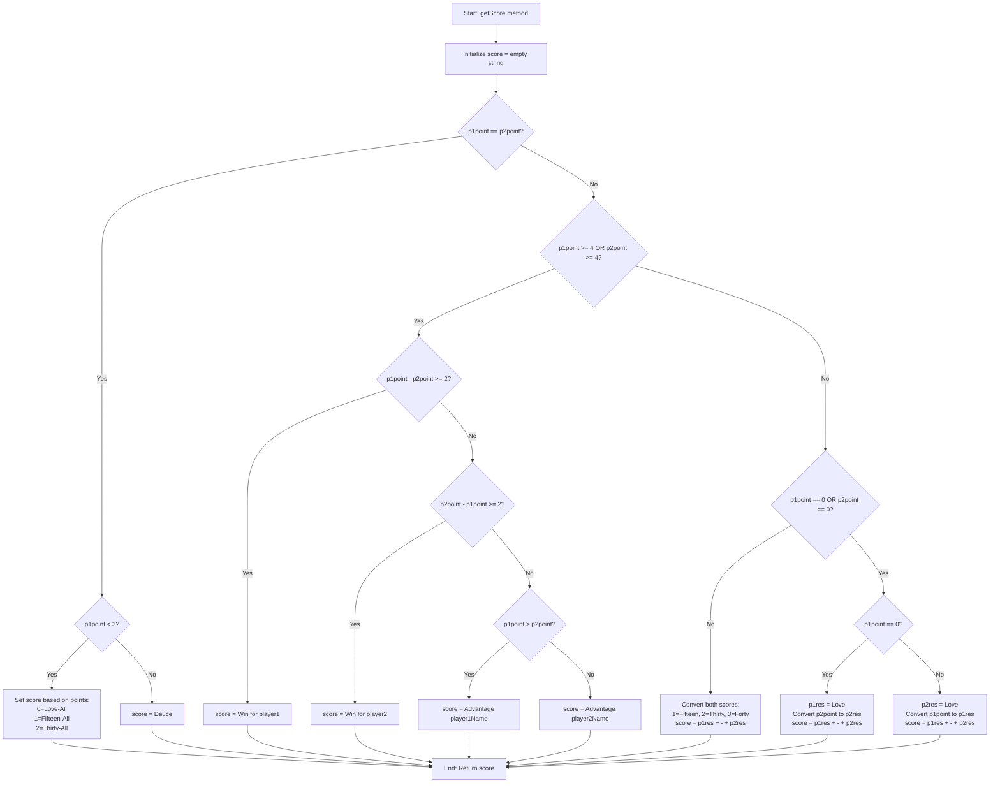

# demo-mermaid

```mermaid
flowchart TD
    A[Start: getScore method] --> B[Initialize score = empty string]
    
    B --> C{p1point == p2point?}
    C -->|Yes| D{p1point < 3?}
    C -->|No| E{p1point >= 4 OR p2point >= 4?}
    
    D -->|Yes| F[Set score based on points:<br/>0=Love-All<br/>1=Fifteen-All<br/>2=Thirty-All]
    D -->|No| G[score = Deuce]
    
    F --> Z[Return score]
    G --> Z
    
    E -->|Yes| H{p1point - p2point >= 2?}
    E -->|No| K{p1point == 0 OR p2point == 0?}
    
    H -->|Yes| I[score = Win for player1]
    H -->|No| J{p2point - p1point >= 2?}
    
    I --> Z
    
    J -->|Yes| L[score = Win for player2]
    J -->|No| M{p1point > p2point?}
    
    L --> Z
    
    M -->|Yes| N[score = Advantage player1Name]
    M -->|No| O[score = Advantage player2Name]
    
    N --> Z
    O --> Z
    
    K -->|Yes| P{p1point == 0?}
    K -->|No| Q[Convert both scores:<br/>1=Fifteen, 2=Thirty, 3=Forty<br/>score = p1res + - + p2res]
    
    P -->|Yes| R[p1res = Love<br/>Convert p2point to p2res<br/>score = p1res + - + p2res]
    P -->|No| S[p2res = Love<br/>Convert p1point to p1res<br/>score = p1res + - + p2res]
    
    Q --> Z
    R --> Z
    S --> Z
    
    Z[End: Return score]
```
